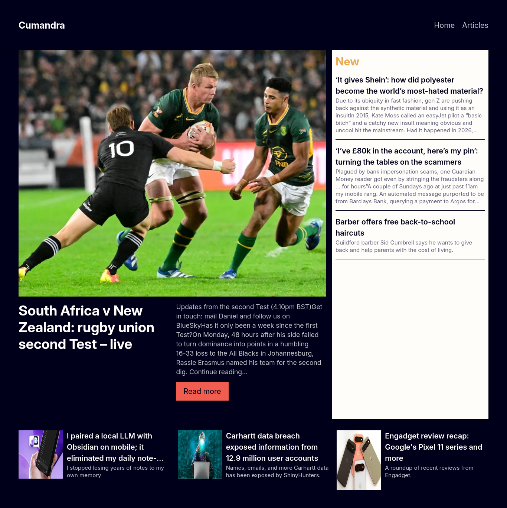

# Cumandra - News Website

This a curated news website built to get new update around the world in respect to different category.

---

## Table of contents

- [Overview](#overview)
    - [The challenge](#the-challenge)
    - [Screenshot](#screenshot)
        - [Links](#links)
- [My process](#my-process)
    - [Built with](#built-with)
    - [What I learned](#what-i-learned)
    - [Continued development](#continued-development)
    - [Useful resources](#useful-resources)
- [Author](#author)
- [Acknowledgments](#acknowledgments)

---

## Overview

### The challenge

Users should be able to:

- View the optimal layout for the interface depending on their device's screen size
- See hover and focus states for all interactive elements on the page

### Screenshot



### Links

- Solution URL: [github.com/PhilipOyelegbin/cumandra.git](https://github.com/PhilipOyelegbin/cumandra.git)
- Live Site URL: [cumandra.vercel.app](https://cumandra.vercel.app)

---

## My process

### Built with

- Semantic HTML5 markup
- Tailwind CSS
- Flexbox
- Grid
- Mobile-first workflow
- [Laravel Blade](https://laravel.com/framework/docs/13.x/blade#main-content) - Laravel
- [TailwindCSS](https://tailwindcss.com) - For styles

### What I learned

Use this section to recap over some of your major learnings while working through this project. Writing these out and providing code samples of areas you want to highlight is a great way to reinforce your own knowledge.

To see how you can add code snippets, see below:

```html
<h1>Some HTML code I'm proud of</h1>
```

```css
.proud-of-this-css {
    color: papayawhip;
}
```

```js
const proudOfThisFunc = () => {
    console.log("🎉");
};
```

If you want more help with writing markdown, we'd recommend checking out [The Markdown Guide](https://www.markdownguide.org/) to learn more.

### Continued development

Use this section to outline areas that you want to continue focusing on in future projects. These could be concepts you're still not completely comfortable with or techniques you found useful that you want to refine and perfect.

### Useful resources

- [Design inspiration 1](https://www.frontendmentor.io/challenges/news-homepage-H6SWTa1MFl) - This helped me with designing the home page.
- [Design inspiration 2](https://www.example.com) - This helped me design the article page.

---

## Author

- Website - [Philip Oyelegbin](https://philip.oyelegbin.name.ng)
- Twitter - [@yelegbinphilip](https://www.twitter.com/oyelegbinphilip)

---

## Acknowledgments

This is where you can give a hat tip to anyone who helped you out on this project. Perhaps you worked in a team or got some inspiration from someone else's solution. This is the perfect place to give them some credit.

---
